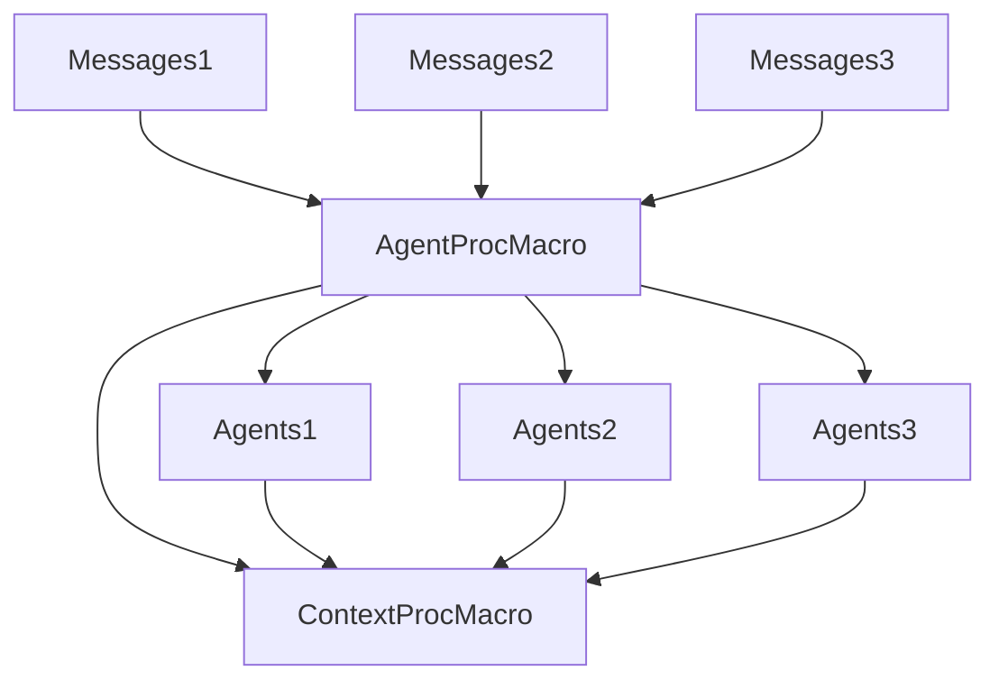

## Target syntax for Messages ##

```rust
// adds the message to a global inventory
#[Derive(Event)]
struct MyEvent {
    field1: Type1,
    field2: Type2,
}

#[Derive(Request)]
#[Response(i32)]
struct MyRequest {
    f: T,
}
```

## Target syntax for Agents ##
```rust
struct MyAgent {
    something: i64,
}

// Agent comes from a proc macro crate that depends on the messages crate.
// So Agent has a list of all the messages to allow for better error messages
#[Agent]
impl MyAgent {
    fn init() -> Self

    async fn handle(&mut self, m: MessageName) -> i32 {
        1
    }
}
```

## What Ctx needs to do ##
```rust

// generated for every message
trait Message {
    const ID: i32 = ...;
}

// generated by make_context!(handlers...)
trait Handle<T: Message> {
    fn handle(&self, m: &T);
}


trait Ctx: Handle<MyMessage1> + Handle<MyMessage2> {
    const fn canHandle(id: i32) -> bool;
}

impl Ctx for MyContext {
    const fn canHandle() -> bool {

    }
}

struct AssertCanHande<C: Ctx, M: Message> {
    const VALUE: () = assert!(C::canHandle(M::ID));
}

fn assertCanHandle<C: Ctx, M: Message>(ctx: &C, m: &M) {
    let _ = AssertCanHande::<C, M>::VALUE;
}

macro_rules! call{
    ($ctx: expr, $msg: expr) => {
        let m = $msg;
        let c = $ctx;
        assertCanHandle(c, m);
        c.handle(m);
    }
}

```

## Crate Graph ##
In the end ContextProcMacro needs to know everything to be able to generate a Context type.
